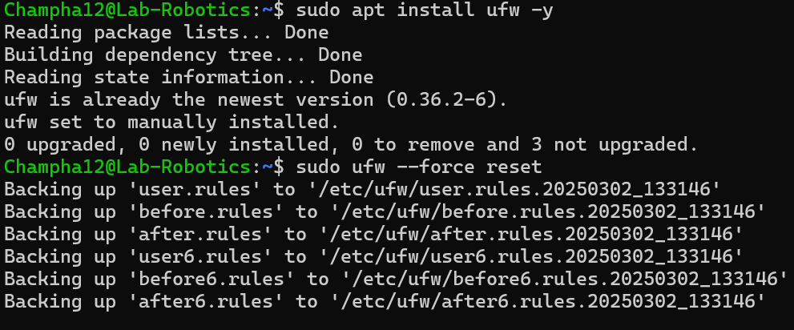
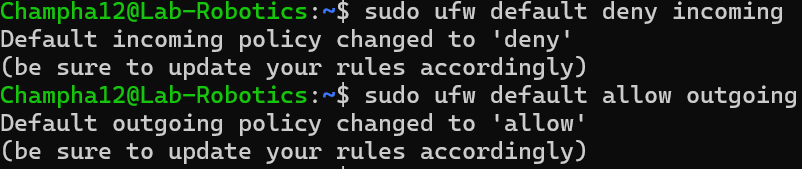
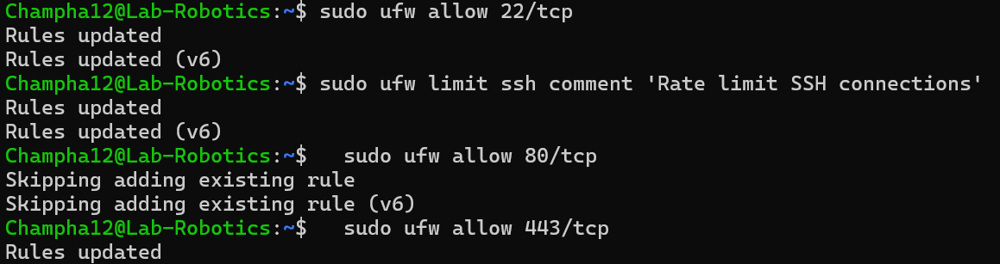
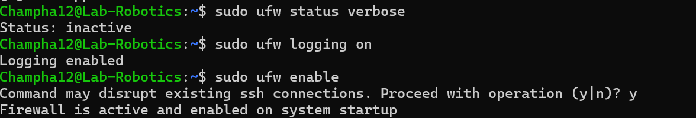
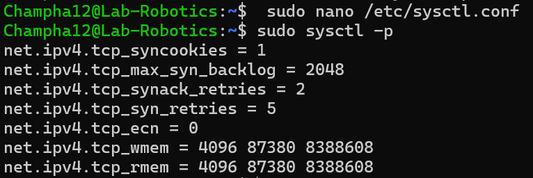
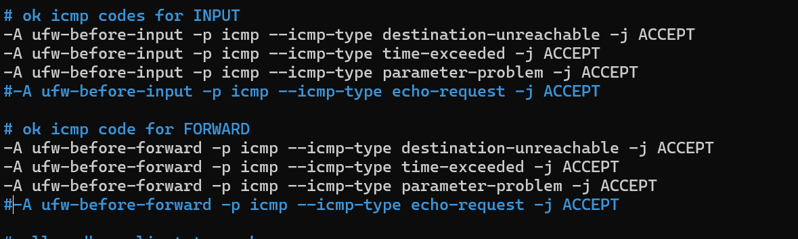
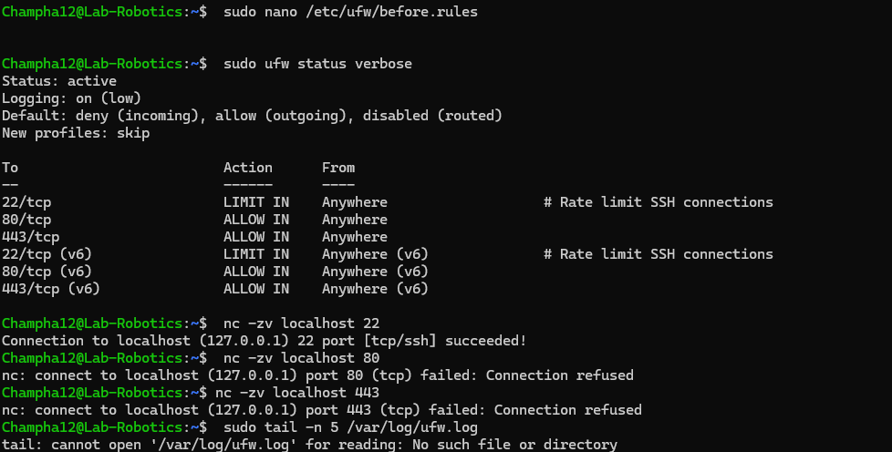

# Champha Thapa

# APT Package Management Assignment

## Part 1: Understanding APT & System Updates

### 1. Check APT Version
sh
apt --version

Output:


### 2. Update the Package List
sh
sudo apt update

Explanation:  
This command fetches the latest package information from the configured repositories, ensuring that the system has the most up-to-date metadata before installing or upgrading packages.

### 3. Upgrade Installed Packages
sh
sudo apt upgrade -y

*DCfference between update and upgrade:*  
- update refreshes the package metadata but does not install or upgrade anything.
- upgrade installs newer versions of the packages based on the updated metadata.

### 4. View Pending Updates
sh
apt list --upgradable

Pending Updates:  


## Part 2: Installing & Managing Packages

### 1. Search for a Package
sh
apt search image editor

Selected Package:  


### 2. View Package Details
sh
apt show zim

Dependencies:  


### 3. Install the Package
sh
sudo apt install zim -y

Confirmation of Installation:  


### 4. Check Installed Package Version
sh
apt list --installed | grep zim

Installed Version:  


## Part 3: Removing & Cleaning Packages

### 1. Uninstall the Package
sh
sudo apt remove zim -y

Is the package fully removed?  


### 2. Remove Configuration Files
sh
sudo apt purge zim -y


*Difference between remove and purge:*  
- remove only deletes the package binaries, keeping configuration files.
- purge deletes both binaries and configuration files.

### 3. Remove Unnecessary Dependencies
sh
sudo apt autoremove -y


Why is this step important?  
It removes unused dependencies that were installed alongside a package but are no longer needed, freeing up disk space.

### 4. Clean Up Downloaded Package Files
sh
sudo apt clean


What does this command do?  
It deletes all downloaded .deb files from /var/cache/apt/archives, freeing up space.


## Part 4: Managing Repositories & Troubleshooting

### 1. List APT Repositories
sh
cat /etc/apt/sources.list

Observations:  


### 2. Add a New Repository
sh
sudo add-apt-repository universe
sudo apt update


Types of Packages in Universe Repository:  
Community-maintained software, which may not receive the same level of support as main repository packages.

### 3. Simulate an Installation Failure
sh
sudo apt install fakepackage

Error Message:  


### 4. Troubleshooting Steps
- Check the package name spelling.
- Ensure the correct repository is enabled.
- Run sudo apt update and try again.
- Search for the package using apt search.
- Check logs in /var/log/apt/.

---

## Bonus Challenge: Holding & Unholding Packages

### 1. Hold a Package
sh
sudo apt-mark hold zim


### 2. Unhold a Package
sh
sudo apt-mark unhold zim


Why would you want to hold a package?  
This prevents the package from being upgraded.

Why would you want to unhold a package?
This allows the package to be upgraded again.

# Champha Thapa
2/19/2025
Virtualization
# 1: Introduction to virtualization concepts
* Virtualization: the procedure for building a virtualized copy of a resource, such an operating system, storage device, or machine.
* Hypervisor: software that makes it possible to create and administer virtual machines (VMs), which let several operating systems operate on one physical computer.
* Virtual machines (VM): It's a technology for building virtualized computing environments. A virtual machine is an emulation of a physical computer. VMs enable teams to run what appear to be multiple machines, with multiple operating systems, on a single computer.
* Containers: Containers are a lighter-weight, more agile way of handling virtualization—since they don’t use a hypervisor.It is an isolated environments that run applications with shared system resources.
* The main differences between VMs and tanks: containers allow developers to improve CPU and memory utilization of physical machines. However, containers go even further because they also enable microservice architectures, where application components can be deployed and scaled more granularly. This is an attractive alternative to having to scale up an entire monolithic application because a single component is struggling with load.
* Main difference: VMs run a full OS with a virtualized hardware layer, whereas containers share the host OS kernel. VMs are more resource-intensive due to their need for dedicated system resources, while containers are more lightweight. VMs provide strong isolation due to separate OS instances; containers share the host OS, offering less isolation.

# Part 2: Working with Multipass
* multipass boot: Launch the default Ubuntu instance.
* multipass list: List all running instance.
* multipass info: View details about a specific instance.
* multipass shell: Access to the shell of a running instance.

* multipass exec: Run the command on the instance.
* multipass stop: Stop the running instance.
* multipass delete: Delete the instance. 


3: Exploring LXD
* LXD (Linux Container Daemon) is a next-generation system container manager built on LXC (Linux Containers). It provides a user-friendly interface to create and manage system containers and virtual machines (VMs), making it easier to run multiple isolated Linux environments on a single host.
* LXD works like a lightweight alternative to virtual machines, offering the benefits of full Linux systems without the overhead of traditional VMs.
* steps of how to run it.


4: How to Stick Apps with Docker
* Basic Docker Concepts

Images: Read-only templates used to create containers.
Containers: Running instances of Docker images.
Dockerfiles: Scripts that gives instruction on how to build a Docker image.


# Assignment 8 - Firewall
3/2/2025
# Champha Thapa, amk1004419@student.hamk.fi

Outline:
This guide outlines the configuration of a Linux server firewall using UFW (Uncomplicated Firewall) to secure server services and mitigate common network threats. It will enable essential services like OpenSSH, HTTP, and HTTPS while logging both permitted and blocked connections. Furthermore, it includes measures to defend against attacks such as SYN floods and ICMP floods.

Install UFW:


# Define Firewall Rules:
Firewall rules are security policies that control incoming and outgoing network traffic based on predefined conditions.
1. Reset UFW to deafult
```  sudo ufw --force reset
```
2. Default policies that blocks everything except allowed
```sudo ufw default deny incoming
sudo ufw default allow outgoing
```


* SSH (Secure Shell) is used for remote server management, but open SSH ports are common attack vectors.
Allow SSH, It's port is 22
```sudo ufw allow 22/tcp
```
Web servers need to accept incoming HTTP and HTTPS traffic for website access.

* Allow HTTP, It's port is 80
```sudo ufw allow 80/tcp
```
* Allow HTTPS, It's port is 443
``` sudo ufw allow 443/tcp
```
* Prevent SYN Flood attacks
``` sudo ufw limit proto tcp from any to any port 22
sudo ufw limit ssh comment 'Rate limit SSH connections'
sudo ufw limit proto tcp from any to any port 80
sudo ufw limit proto tcp from any to any port 443
```


# Logging Configuration
* Logging aids in tracking network activity, troubleshooting problems, and identifying possible security threats.
* Enable logging


# SYN Flood Protection
A SYN flood attack exploits the TCP handshake to exhaust server resources.

* Add the following to
``` sudo nano /etc/sysctl.conf
```

# Block invalid packets
Malicious actors often send malformed packets to bypass security measures and exploit system vulnerabilities.

In a typical TCP Three-Way Handshake, every new connection begins with a SYN packet. However, if a TCP connection is initiated with an unexpected flag or an unusual combination—such as those used by port-scanning tools like Nmap—these packets should be blocked to enhance security.

Add the following to sudo nano /etc/ufw/before.rules

# Blocking Ping (ICMP) Requests

Why Block ICMP?
A ping flood attack, also known as an ICMP flood, is a type of Denial of Service (DoS) attack where an attacker overwhelms a system by sending a massive number of ICMP echo request packets (pings). This excessive traffic can consume network resources, slow down services, or even cause system crashes. Blocking or limiting ICMP requests helps protect against such attacks.
# How to prevent ICMP requests
1. Open the file sudo nano /etc/ufw/before.rules


